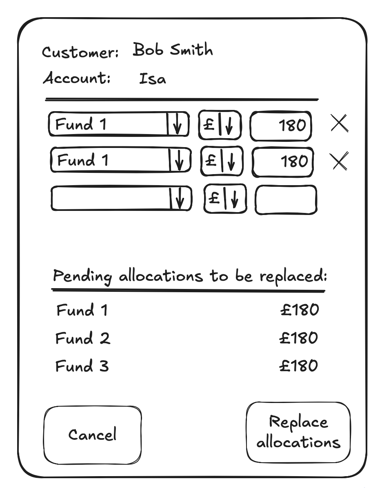
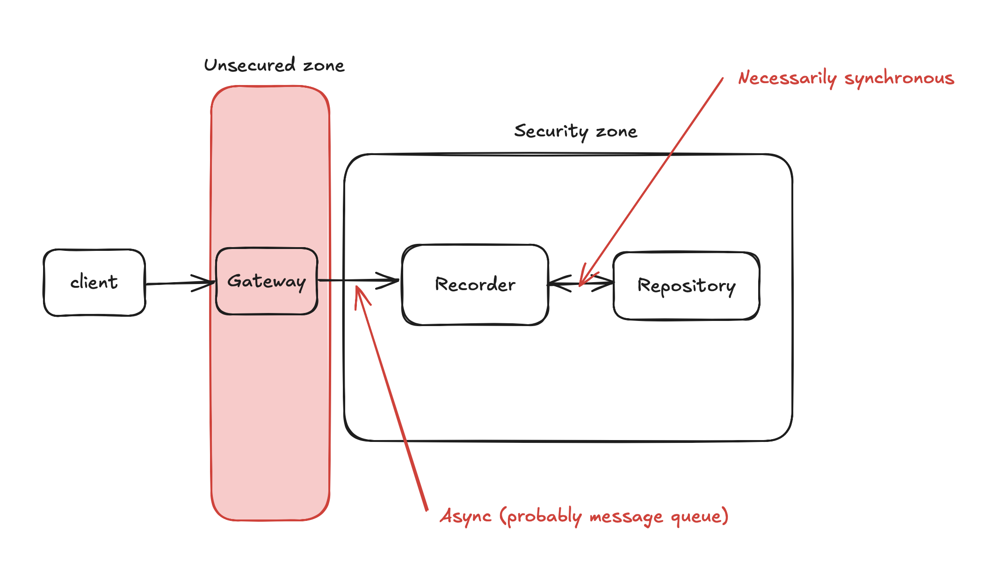

# About

This repository demonstrate's my (Colin Yates) "engineering thought process" around the provided scenario.

My first assumption is that my "working out" is more important than the final answer. Given the time constraints it is unlikely I will get to a complete final answer, and so I will prioritise capturing my thoughts.

## Theory of Constraints

I believe the Theory of Constraints is an incredibly powerful toolkit in both reasoning about, and also articulating reality. To keep this brief, I will only reference "the core dilemma", which underpins almost every decision we make: "invest in now" versus "invest in tomorrow".

# Goal and purpose

The goal of this repository is "determine whether our engineering principles and thought processes are compatible"

My personal ambition ("goal" indicates too strong a requirement) is "have fun and learn something new"

# Starting conditions and assumptions

_Everything_ in software engineering is a compromise; one of many alternatives, each with differing pros and cons and there are very few global truths. I could write 100 pages on the various _valid_ decisions trees I see here, but I have to start somewhere. This section will detail the high level/coarse grained decisions and assumptions I am making, including my "default preferences" in order to avoid "analysis paralysis" and identify a way forward.

## Ownership

Everybody owns the _solution_ regardless of which part of the solution you build. QA teams are _not_ in charge of quality. The team is. The QA process should be merely a tick-box activity that "yes, the software handles all these esoteric and unusual abuses". Everybody is responsible for building the right solution.

Decisions should be made "by the one most qualified". The business is the overriding authority and all decisions subordinate to that, but _how_ the business need is met is done via an "authoritative democracy". The best idea wins. Of course, not everybody has "the best" idea, and in reality it can be like herding cats, but when done right, it is amazing effective. Without this, silos of knowledge and ownership thrive, and that is actively harmful to the short term and long term success.

In practice, this looks like individuals making decisions which are trusted by everybody because there is space for regular **respectful** scrutiny and challenge. _Everybody_ is expected to respond to questions of clarity and be open for upgrades.

## Ignorance

"Ignorance is bliss". The more ignorance we can make components in our software the better. The more ignorant components are the more isolated, decoupled, atomic, resilient, simple (non-complex), and robust. This is measurable partly at the code level (how many other modules do I depend on) but not entirely. Ignorance, or "know as little as possible" is a gift that keeps on giving.

## Skill level

The team is of middle to high skill and has a good working knowledge of:

- type theory
- golang
- web technologies

If this assumption is _false_ then I would see this as a learning opportunity to upskill myself and the team.

## Bounded Contexts

The scenario states **"keep the functionality for retail ISA customers separate from it’s Employer based offering
where practical"**. This would strongly signal the use of a DDD (Domain Driven Design) Bounded Context (e.g. a separate and cohesive module that reflects the business).

I don't know enough of the internal company structure or the existing solution spaces or implementation spaces, so I'm going to treat this as completely separate. I fully expect there to be a wealth of infrastructure that can be reused and governance related solutions the code needs to fit inside. For now, I'm ignoring them. Reworking into those should be fairly straightforward.

## Security zones

Trust no-one outside your security zone, and trust implicitly inside your security zone.

Authoritative validation should be done once, in one-place. Anything past that point can be trusted. Otherwise the code base is littered with paranoia and noise, and worse, insufficient validation.

The core domain should be inside the security zone. If I'm expecting a non-null email address then it is checked at the boundary. Once inside the security zone **it is a non-null email address**.

I consider anything from the UI outside the security zone, and validation done in the UI is optimistic, not authoratitive.

## Prefer making invalid states impossible

It should be **impossible** to break an invariant in the code base. If the core domain requires a non-null email address then the compiler should, as much as possible, enforce that invariant.

A separate `NullableEmail` and `Email` (or `EmailFactory` which returns an `OkOrError` monad etc.) types can make the code significantly more robust. This is another example of ignorance: why when using an `Email` in the core domain should anybody need to know it was ever nullable?

This absolutely sits on the horns of the core dilemma of invest now/invest later. It requires more work upfront to do this and increases the surface area, but it is much _simpler_ (non-complex) and continues to pay off over time.

## Business logic on the backend, as thin as possible presentation logic on the front end

I've found great simplicity in having the front end delegate as much as possible to the back end. I'm specifically talking about things like validation and filling in lists and sublists etc.

The immediate reservation is performance - validation in the front end is surely more performant. Yes, without a doubt. Websockets are great, but validating "is this an email address" via a regexp in JS is of course more performant than websockets to the back end.

However, validating on the front end actually has a number of costs:

- it's duplication. The UI is outside the security zone so whatever gets sent from the front end requires re-validating anyway.
- it's insufficient. The UI can't, on it's own, validate the email address is _semantically_ correct (it is unique, from a meaningful and known domain etc.)
- it's a "window of risk" for duplication on the front end and backend ro diverge.

I've had great success lazily validating the UI (i.e. validating _as_ they type in parallel) over websockets such that the UX is sufficient _and_ the value of the validation is significantly higher. UI validation tends to validate _syntax_, the backend can validate _syntax_ and _semantics_.

### Lists and sublists

This extends to filling in lists and sublists. Often the UI will be front loaded with a whole bunch of reference data, e.g. all the possible funds available. And very often choosing one thing will populate a sublist based on that choice.

This _can_ be a significant security list. Front loading all the reference data and then filtering on the UI does expose (albeit typically obfuscated in JS "stores") a "window of risk" around that data. Having the server only return valid data, on demand, removes this window. Again, performance is to be considered.

Of course, websockets mandate a connection to the server and rules out any offline use.

## Test Driven Development

TDD (explicitly https://tidyfirst.substack.com/p/canon-tdd) is a super-power. It _helpfully_ adds a brake to developers who tend of "code first, think second". Listing the various scenarios first is such an obvious, but unfortunately overlooked step.

I _do_ believe in tests capturing and documenting decisions made, and thoroughly wrap my code with tests, but the main benefit I've seen from rigorous TDD is getting developers to slow down and think first.

## Collaboration

I believe most projects fail because of rework. Even the best teams can "build the wrong thing right". Before even attempting writing production code I would have a series of collaborative discussions (whiteboard, event storming, chatting at the pub, whatever), all with the aim of ensure "we both understand what is being asked" so that "we both know we are solving the problem the right way".

Achieving this state is **hard**. The cliche of "write one to throw away" is, I believe, a reflection of how hard this is, and is premised upon the first software being wrong because it's impossible to get it right. I also believe that "working software" is a great requirements tool. Users actually _seeing_ what they've asked for brings clarity in a way talking, whiteboards, PPTs, diagrams etc. don't.

However, there is no space for that here, so I'm going to proceed having explicitly noted there is a significant risk of ambiguity.

I would, however, want to address this risk, typically by showing some working (for some definition of working!) software ASAP to mitigate this risk.

## Shapes on a whiteboard are more important than code to build the shapes

I have seen projects fail because clever coders have built the wrong shapes. Components which are too entangled/coupled. Assumptions made across multiple components. Cross cutting concerns not extracted and applied at the right layer.

This may be controversial, but I would take "good shapes poorly coded" over "bad shapes coded well". The right shapes, by definition, provide isolation of themselves from everywhere else ("ignorance everywhere"), and can be refactored/rewritten safely. Untangling shapes is significantly harder.

## Out of scope

The following are important but I have to move on, so I am merely listing them.

- Rework is the killer so avoid at all costs. Rework comes from not understanding reality sufficiently so prototype, whiteboard, collaborate, discuss as much as possible before committing to production code. Rework from "bad code" is typically not an issue. Rework from "ah, now I see it I understand" is significant, so get to "now I see it" as quickly as possible.
- Code **are** comments. Comments describing what the code _does_ are a smell. Comments describing _why_ the code works the way it does are often necessary and valuable.
- CQRS (Command Query Responsibility Separation/Segregation). This is an incredibly powerful paradigm where each need is addressed by a separate "stack". That stack is typically fed from a single authoritative event stream and can use whatever tools (denormalised databases, custom model, caches etc.) it needs. **Strongly** recommend where needed.
- Event Logs are an incredibly architectural and/or design tool, and I generally prefer them unless there is a reason not to (they aren't without cost), but I'm going to put it to one side now.
- Coding paradigm. Golang is the preferred stack which is more procedural than FP and doesn't support discriminated unions or monads.
- Internationalisation. I typically default to doing this on the backend because it is necessary for automated reports and emails for example.
- Co-ordinated transactions (Two Phase Commit). The service that actually _applies_ the allocations will almost certainly be expected to co-ordinate across multiple transactional boundaries. That is most definitely out of scope for this.

# The Work!

## Clarity - YAGNI?

The first thing that jumps out at me is "however in the future we would anticipate allowing selection of multiple options". I would immediately want clarity around:

- how likely is this?
- what is the time frame this is going to happen in?
- why not now?

The impact analysis for changing this later is, I would propose, simply building the capability in now, so the fact it has been deferred makes me nervous. Changing cardinality is _always_ disruptive and impacts almost everything.

There are three options:

1. Proceed with a single selection. Risk is costly change in future, but gain is avoidance of unnecessary work and arguably quicker time to market (arguably because I don't think it is really.)
2. Support multiple selection now. Pros/Cons is inverse of 1.
3. Support multiple selection and hide (probably just the UI) behind a feature toggle.

**Decision**:
Given that "1" is both singular and plural (i.e. a set of 1), and my gut instinct that "multiple selection" is such an obvious use-case I will proceed on the basis of 3.: the UI will expose a single selection but the core domain will accept a (non-empty) sequence.

## Clarity - Threshold

The spec states "deposit £25,000 into a ISA". My understanding is that ISAs are restricted to £20,000 so this use-case is an error condition? This requires collaboration with the domain experts, but for now I will proceed on my local knowledge.

**Decision**:
Maximum allowance for a tax year is £20K, but good engineering practices suggest the value should be easy to change.

## Clarity - User interface

It isn't clear exactly what the screen will look like. Whilst the spec states that allocations can be "queried at a later date", it isn't clear _when_ or _why_ that will happen. For example, should the user be able to see their existing allocations when making a new allocation?

**Decision**:
I don't think it is necessarily useful to see already processed allocations when making a new (set of) allocations. However, it _is_ useful to see any pending allocations. Therefore the following the UI will show the existing set of pending allocations (if any) and will allow a new set to be defined:

## Clarity - Asynchronous/Synchronous

The spec states "Given the customer has both made their selection and provided the amount the system should record these values and allow these details to be queried at a later date."

It explicitly _doesn't_ state "apply the defined fund allocations". This choice of words ("record these allocations") screams out that the _application_ of the request is done at a later date, asynchronously, and therefore introduces a Saga where the state transitions includes a "pending" state:

- Submits -> Pending -> Execution/Application -> Complete

This also introduces the possibility of being able to change a pending allocation, to cancel, or amend it.

NOTE: a decision here is the management of the allocations. Should they be multiple submissions which are handled one by on, coalesced into one, etc. For simplicity I **assume** that there is only one set of allocations which, whilst pending, can be cancelled or replaced.

Without collaboration and discussion I will proceed on the assumption that it is a Saga, but this does add significant complexity and is a fundamental architectural decision so I would look for clarity ASAP.

## Clarity - Lifetime of data

The spec states "allow these details to be queried at a later date.". I take this to mean "scoped to the lifetime of the account" rather than "scoped to the lifetime of the allocation process".

## Impact tree

As this is new work, I am making a _big_ assumption that the impact assessment of this work is empty: there is no impact on the existing solutions.

## Direction of solution

The following is the ubiquitous language:

- accountId: identifies a unique customer account. (May be a path if the Customer is the aggregate root)
  - NOTE: this is expected to be provided by the security infrastructure, but for convenience is provided as a free parameter to the API.
- fundAllocations: a non-empty `Map` from `fundId` to `amount`
- emptyOrPendingAllocations: an optional `fundAllocations` which are restricted to the currently pending allocations.
- fundId: identifies a unique Fund
- amount: a **positive** amount of a single currency
- emptyOrAllocations: all allocations for a given `accountId`. This is a triplet of `{dateReceived, dateApplied, fundId, amount, status}`.
- allocation status: the status of an allocation. These outcomes are either: Pending, Succeeded, Failed(reason)
- pending allocations: the allocations for a given `accountId` that have been acknowledged but not applied
- allocationProcessor: the actual processor of the `fundAllocations`. Due to the asynchronous nature, this will be a message bus or actor model.

NOTE: It is assumed the `accountId` is trusted and provided automatically by the security infrastructure middleware and therefore can be trusted.

NOTE: the failure state for an allocation would typically contain an error code and a payload, for example, if the error code signified a threshold was breached, the payload might contain the threshold. For simplicity I am modelling just a string.

There will be three moving pieces:

- Security gateway: a gateway separating the untrusted zone from the trusted zone
- Processor: interface behind which the business logic lives
- Repository: a persistent store with a synchronous API that contains allocations and their output for a given `accountId`

## The gateway/security zone boundary

This sits on the boundary of the security zone and so will not trust anything it receives (other than things provided by the existing infrastructure, like the `accountId` for example).

### GET /allocations/{accountId} end point

Returns a list of allocations for the given `accountId`. Returns `emptyOrPendingAllocations`.

#### Happy cases

The single happy case is that there are 0 (i.e. None) or more allocations.

#### Error case

There are no _domain specific_ error cases although there may, of course, be a multitude of infrastructural error cases.

### POST /allocations end point

Accepts an `{accountId, emptyOrPendingAllocations}` and persists the requested `emptyOrPendingAllocations`. This merely acknowledges receipt of the request, the effect of which replaces any existing fund allocations.

### Happy cases

The happy cases are best identified using a state table.

| Existing pending allocations | Payload     | Outcome                                                                      |
| ---------------------------- | ----------- | ---------------------------------------------------------------------------- |
| None                         | None        | accountId has no pending allocations                                         |
| One or more                  | Empty       | accountId's existing pending allocations are _deleted_                       |
| One or more                  | One or more | accountId's existing pending allocations are replaced by the new allocations |
| None                         | None        | accountId's has no pending allocations                                       |

NOTE: technically, the "None/None" could be considered an error condition, but I _assume_ there is very little value in identifying this situation, and therefore it is treated as a happy case to make the API more ergonomic.

## Allocation processor

The Allocation processor is responsible for the business logic of actually allocating funds. It would typically be comprised of two parts:

- an asynchronous scheduler
- the (DDD) core domain which is synchronous, is ignorant of infrastructural concerns, and observable.

NOTE: This is _exactly_ where a message bus and Event driven architecture has value, with the processor accepting `AllocationFunds` commands and emitting `FundAllocationMade` events, but that is out of scope here.

For simplicity, I'd suggest its implementation delegates scheduling to looking up outstanding applications from the repository, but this is a pragmatic decision and I would expect this decision to be revisited once more clarity over the domain was given. I'm not a fan of Repositories "entangling" multiple concerns, and would rather have each "slice" define their own needs, but pragmatism is aware of time...

It's API is trivial, with a single asynchronous strongly typed entry point that accepts `{accountId, emptyOrPendingAllocations}`. This takes care of scheduling and applying the allocations.

In order to work it needs to know about any outstanding funds. A reactive event based system would make sense here, but given the amount of ambiguity I am proceeding with delegating this to the repository and will use a simple "wake up and check every <amount of time>" paradigm.

NOTE: there is no observability, and events would make a lot of sense here!

For now, we will start with simply an `AllocationRecorder` which merely records those allocations.

## Allocation repository

The Allocation repository is a persistent store of fund allocations and will necessarily be synchronous. It will act as the System of Record in lieu of an event based Event Log.

It exposes the following API:

| Function               | arguments                            | Outcomes                                                |
| ---------------------- | ------------------------------------ | ------------------------------------------------------- |
| listPendingAllocations | accountId                            | `EmptyOrPendingAllocations` are returned                |
| setPendingAllocations  | accountId, EmptyOrPendingAllocations | existing allocations are deleted or updated accordingly |

NOTE: It is highly anticipated that a more generic `listAllocations(statuses)` will be needed, but it is out of scope right now.

# Future upgrades

An Event/Event Log based system would introduce a number of benefits:

- enhanced observability
- "the world's best audit log"
- clearer data structures (events themselves have high semantic value)
- the processor can be reactive rather than polling

A stronger type system would also provide a more robust code base:

- `null` is ambiguous and requires defensive programming. The `Option` monad, or other discriminated unions would make the code more robust and elegant.
- `Error` monad and language support for error short-cutting removes a lot of noise from the code base

A more "CQRS" focussed approach would move some of the logic out of the repository and allow the processor to store its own model of outstanding allocations.

Because Go lang requires members to be public in order to be annotated with JSON modifiers, the question arises of whether to use DTOs in the "gateway" layer and keep the domain _pure_. For such a small domain this is probably overkill right now.
